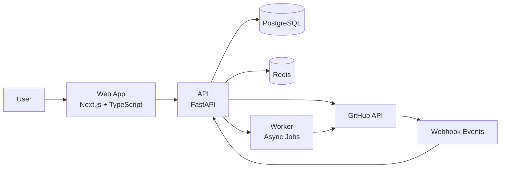

# Splash-UI Architecture

## Overview
Splash-UI is a local-first, cloud-ready application for governed configuration edits in GitHub repositories.

## System Context Diagram

## Components
- Web App (`apps/web`): login, repo browsing, config editor, diff view, workflow UI.
- API (`apps/api`): auth, repository read APIs, parser orchestration, approval logic.
- Worker (`apps/worker`): asynchronous branch/commit/PR jobs and retries.
- Database (PostgreSQL): users, OAuth connections, change requests, audit events.
- Redis: background queue and short-lived task state.
- GitHub Integration: OAuth, repository content API, pull request automation, webhooks.

## Request Flows
### Read Flow
1. User authenticates via email or GitHub OAuth.
2. UI requests repositories and file tree from API.
3. API fetches repository data from GitHub and returns normalized response.

### Edit + PR Flow
1. User edits config in structured UI and reviews diff.
2. API validates payload and stores draft change request.
3. Worker creates branch, commits change, and opens PR in GitHub.
4. Webhooks update approval/merge state back into Splash-UI.

## Security Notes
- Never store hardcoded credentials in code.
- Store GitHub tokens securely and rotate compromised tokens.
- Enforce role-based permissions for edit/approve actions.
- Keep an audit trail for auth, edits, and workflow transitions.

## Deployment Notes
- Local development via Docker Compose.
- Cloud deployment path: containerized services on AWS/Azure.
- Add observability (logs/metrics/traces) before production.
