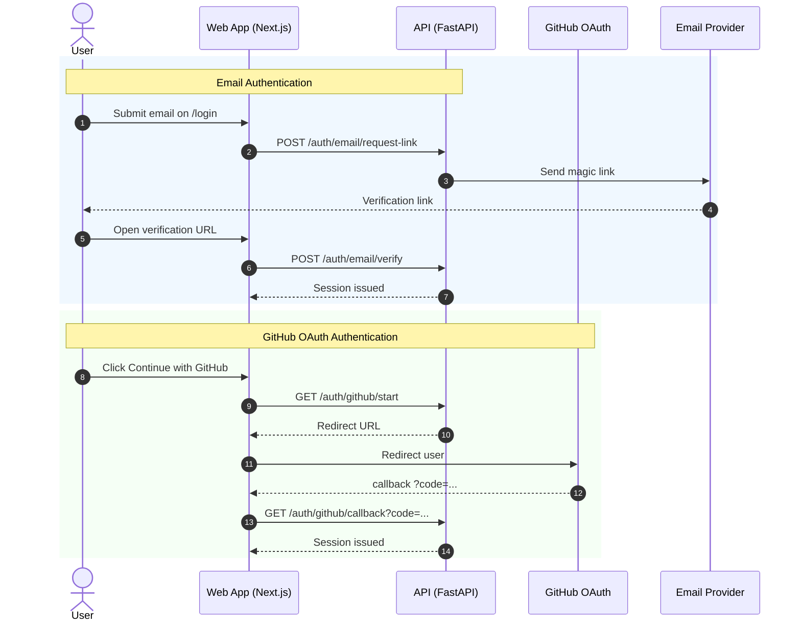

# Authentication Flow (Phase 1)

See [GitHub OAuth Scopes](./github-scopes.md) for the minimum repository access Splash-UI needs during the repository browser phase.

```mermaid
sequenceDiagram
  autonumber
  actor User
  participant Web as Web App (Next.js)
  participant API as API (FastAPI)
  participant GitHub as GitHub OAuth
  participant Email as Email Provider

  rect rgb(240, 248, 255)
    Note over User,API: Email Authentication
    User->>Web: Submit email on /login
    Web->>API: POST /auth/email/request-link
    API->>Email: Send magic link
    Email-->>User: Verification link
    User->>Web: Open verification URL
    Web->>API: POST /auth/email/verify
    API-->>Web: Session issued
  end

  rect rgb(245, 255, 245)
    Note over User,GitHub: GitHub OAuth Authentication
    User->>Web: Click Continue with GitHub
    Web->>API: GET /auth/github/start
    API-->>Web: Redirect URL
    Web->>GitHub: Redirect user
    GitHub-->>Web: callback ?code=...
    Web->>API: GET /auth/github/callback?code=...
    API-->>Web: Session issued
  end
```
