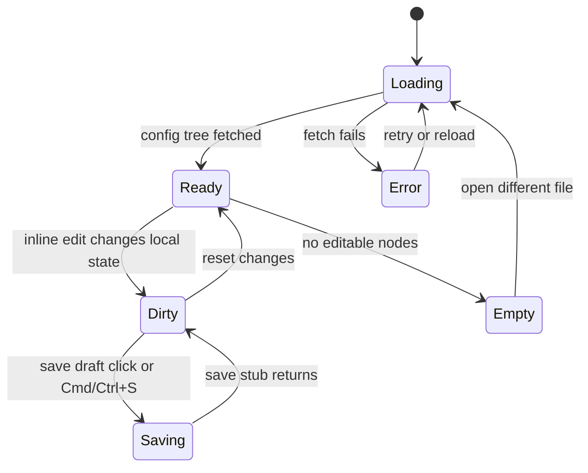

# Editor State Diagram

```mermaid
stateDiagram-v2
  [*] --> Loading
  Loading --> Ready: config tree fetched
  Loading --> Error: fetch fails
  Error --> Loading: retry or reload

  Ready --> Dirty: inline edit changes local state
  Dirty --> Ready: reset changes
  Dirty --> Saving: save draft click or Cmd/Ctrl+S
  Saving --> Dirty: save stub returns

  Ready --> Empty: no editable nodes
  Empty --> Loading: open different file
```
